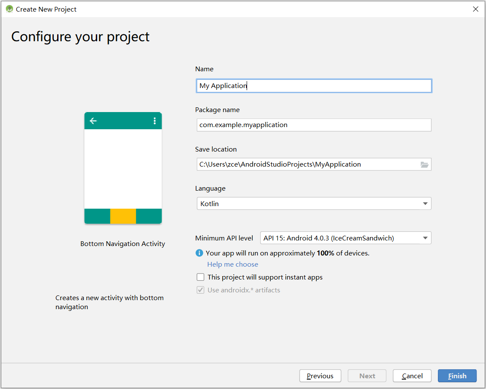
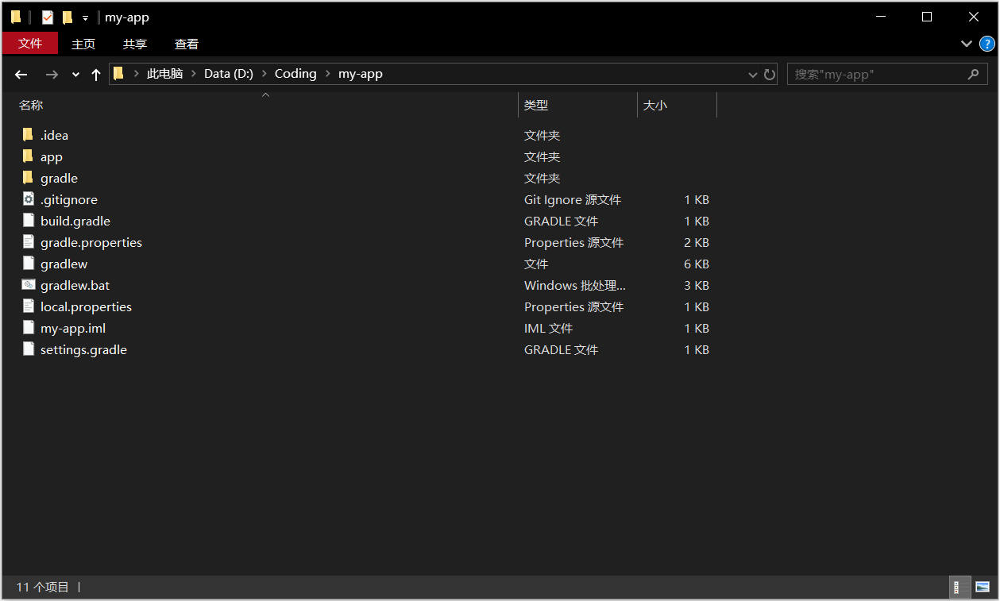
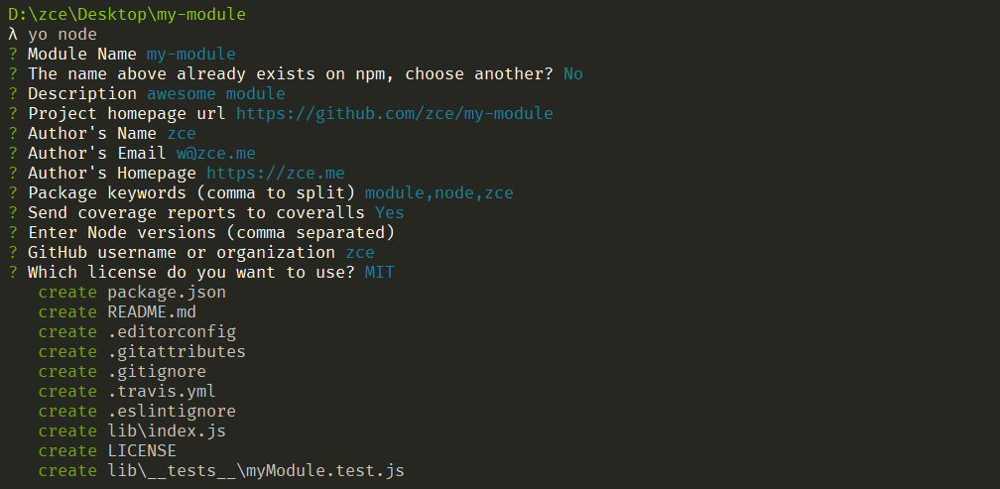

在对前端工程化的整体有了初步的认识之后，我们顺着一个项目的开发过程，先从脚手架开始，探讨前端工程化在项目创建环节中的具体表现。

脚手架可以简单理解为用来自动帮我们创建项目基础文件的工具。看似很普通的需求，背后却饱含哲学，因为除了创建文件，它更重要的是提供给开发者一些约定或规范。

### 脚手架的本质作用

通常我们在开发相同类型的项目时都会使用一些相同的约定，其中包括：

- 相同的文件组织结构
- 相同的代码开发范式
- 相同的模块依赖
- 相同的工具模块配置
- 相同的基础代码

这样一来就会出现在搭建新项目时有大量重复工作要做。脚手架工具就是用来解决此类问题的。我们可以通过脚手架工具快速搭建特定类型项目的基础骨架结构，然后基于这个基础结构进行后续的开发工作。

如果你用过一些例如 Visual Studio 或者 Eclipse 这样的大型 IDE，它们创建项目的过程实际上就是一个脚手架的工作流程。以 Android Studio 为例：

一、创建项目


二、选择项目类型


三、填写项目属性和相关配置



四、得到基础的项目骨架结构



而前端项目创建过程中，由于技术选型多样，又没有一个权威的统一标准，所以前端方向的脚手架都是独立的工具，而且相对复杂。但是本质上所有的脚手架目标都是一样的，它们都是为了解决在创建项目过程中的重复工作。

### 常用的脚手架工具

目前市面上有很多成熟的前端脚手架工具，但是大都是为特定类型的项目服务的（提供集成的工程化方案），例如：

- create-react-app → React.js 项目
- vue-cli → Vue.js 项目
- angular-cli → Angular 项目

这些工具的实现方式也都大同小异，无外乎就是根据你提供的一些信息自动生成一个项目所需要的特定文件结构及相关配置。不过它们一般只用于自生所服务的框架项目。

还有一些以 Yeoman 为代表的通用型项目脚手架工具，它可以根据一套模板生成一个对应的项目结构。这种类型的脚手架一般都很灵活，容易扩展。

除了以上这些创建项目时才会用到的脚手架工具，还有一类脚手架也非常有用，代表性的工具叫做 Plop，它用来在项目开发过程中创建特定类型文件。例如创建一个新的组件或是一个新的模块，因为这些组件或者模块一般都有特定的几个文件组成，而且每个文件都需要有一些基本的结构，相对于手动创建，脚手架更为便捷稳定。

接下来我们挑选几个有代表性的工具做深入探究。

### Yeoman


时至当下 React.js、Vue.js 和 Angular 大行其道，而且这些框架官方都提供了更为集成的脚手架工具链，所以大家在讨论脚手架时最先想到的往往都是 create-react-app 和 vue-cli 这样的工具。对于这一类的工具因为太过针对某个技术，而且使用上也非常普及，我就不做过多介绍了。

这里我们着重探讨 Yeoman，因为 Yeoman 作为最老牌、最强大、最通用的脚手架工具，它有更多值得我们借鉴和学习的地方。

Yeoman 官方的定义是一款用于创造现代化 Web 应用的脚手架工具，不同于 vue-cli 这样的工具，Yeoman 更像是一个脚手架的运行平台，我们可以通过 Yeoman 搭配不同的 Generator 创建任何类型的项目，也就是说我们可以通过创建自己的 Generator 从而定制我们自己的前端脚手架。

Yeoman 的优点同样也是它的缺点。在很多专注基于单一框架开发的人眼中「Yeoman 过于通用，不够专注」，所以他们更愿意使用像 vue-cli 这类的脚手架，这也是这类工具成功的原因。

但是这并不妨碍我们去学习它，那接下来我们就快速了解一下 yeoman 的用法以及 generator 的工作原理，为我们后面开发自己的脚手架做出准备。

#### Yeoman 基本使用

Yeoman 是基于 Node.js 开发的一个工具模块，使用它的第一步自然是通过 NPM 在全局范围安装它（前提需要有正常的 Node.js 环境）：

```shell
$ npm install yo --global # or yarn global add yo
```

通过之前的介绍，我们应该知道，单单只有 `yo` 这个模块是不够的，因为 Yeoman 是需要搭配特定的 Generator 使用的。我们需要找到用于生成我们想要的类型项目的 Generator，例如：我们想要生成一个 Node module 项目，我们可以使用 `generator-node`，使用的方式同样也是将其安装到全局范围：

```shell
$ npm install generator-node --global # or yarn global add generator-node
```

有了这两个模块过后，我们就可以通过运行命令去使用 Yeoman 帮我们创建一个新的 Node Module 项目：

```shell
$ cd path/to/project-dir
$ mkdir my-module
$ yo node
```



#### Yeoman Sub Generator

有时候我们并不需要创建完整的项目结构，可能只是需要在已有项目基础之上创建某种类型的项目文件。例如给一个项目创建 README.md，又或是在一个原有项目之上某些配置文件，你可以使用 Yeoman 的 Sub Generator 特性来实现。这里我们可以使用 `node:cli` 这个 Sub Generator 来为我们的模块添加 cli 支持，让其成为一个 cli 应用：

```shell
$ cd path/to/project-dir/my-module
$ yo node:cli
```

此时命令行终端会提示是否覆盖 `package.json`，我们选择 Yes：

```shell
$ yo node:cli
 conflict package.json
? Overwrite package.json? overwrite
    force package.json
   create lib\cli.js
```

值得注意的是，并不是每个 Generator 都提供 Sub Generator，所以我们在使用之前，需要通过你所使用的 Generator 官方文档来明确。

#### Yeoman 的常规使用步骤

由于 Yeoman 是一个通用型的脚手架工具，所以我们几乎可以使用它去创建任何类型的项目。使用 Yeoman 一般需要遵循以下几个步骤：

1. 明确你的需求；
2. 找到合适的 Generator；
3. 全局范围安装找到的 Generator；
4. 通过 Yo 运行对应的 Generator；
5. 通过命令行交互填写选项；
6. 生成你所需要的项目结构；

例如，我们需要创建一个网页应用：

1. 通过 https://yeoman.io/generators/ 寻找需要的 Generator；
2. 运行 `npm i generator-xxx -g` 全局范围安装此 Generator；
3. 创建项目根目录，在此目录中运行 `yo xxx` 启动脚手架；
4. 完成选项回答；

#### 自定义 Generator

通过前面对 Yeoman 基本使用的介绍，我们发现通过不同的 Generator 可以生成不同的项目，也就是说我们可以创造自己的 Generator 去帮我们生成自定义的项目结构。

即便是市面上已经有很多的 Generator，我们还是有创造 Generator 的必要，因为市面上的 Generator 都是通用的，而我们实际开发过程中还是会出现一部分基础代码甚至业务代码在同类型项目中还是一样，我们可以把这些公共的部分都放到脚手架中生成，让脚手架工具的价值最大化。

例如，我们在创建 Vue.js 项目时，默认情况下官方的脚手架工具只会创建一个最基础的项目骨架，但是这并不包括我们需要经常用到的模块，例如 axios、vue-router、vuex。你需要在每次项目创建过后再去引入这些模块，再去编写一些基础的使用代码。试想一下，如果我们把这些也放入到脚手架中，那么这个问题就不存在了。

那么，自定义 Generator 应该如何具体去实现呢？接下来我们就通过自定义一个带有一定基础代码的 Vue.js 项目脚手架来跟大家介绍。

##### 创建 Generator 模块

创建 Generator 实际上就是创建一个 NPM 模块，一个基本的 Generator 结构如下：

```
├─ generators/ ········································ 生成器目录
│  └─ app/ ············································ 默认生成器目录
│     └─ index.js ····································· 默认生成器实现
└─ package.json ······································· 模块包配置文件
```

如果你需要提供多个 Sub Generator，你可以在 `app` 的同级目录添加一个新的生成器目录，例如：

```diff
 ├─ generators/ ········································ 生成器目录
 │  ├─ app/ ············································ 默认生成器目录
 │  │  └─ index.js ····································· 默认生成器实现
+│  └─ component/ ······································ 其他生成器目录
+│     └─ index.js ····································· 其他生成器实现
 └─ package.json ······································· 模块包配置文件
```

此时我们的这个模块就支持 `yo my-generator:component` 这种 Sub Generator 的用法。

同时，Yeoman Generator 还支持直接将生成器目录放到项目根目录下：

```
├─ app/ ··············································· 默认生成器目录
│  └─ index.js ········································ 默认生成器实现
├─ other/ ············································· 其他生成器目录
│  └─ index.js ········································ 其他生成器实现
└─ package.json ······································· 模块包配置文件
```

除了特定的结构，还有一个与普通的 NPM 模块所不同的是，Yeoman Generator 模块的名称必须是 `generator-<name>` 的格式。

> 如果你需要你的模块在 Yeoman 官方的 Generator 列表中出现，你可以在模块的 `keywords` 属性中添加 `yeoman-generator`。

接下来我们来做一些具体的演示：

1. 创建一个 `generator-sample` 的文件夹作为模块目录
2. 在此目录下通过 `npm init` 创建 `package.json`
3. 安装 `yeoman-generator` 模块依赖
4. 按照结构要求创建 `generators/app/index.js` 文件

```js
// generators/app/index.js
// 此文件为 Generator 的核心入口
// 需要导出一个继承自 Yeoman Generator 的类型
// Yeoman Generator 工作时会自动调用在此类型中定义的一些生命周期方法
// 我们可以通过调用父类中提供的一些工具方法实现一些类似文件写入的功能

const Generator = require('yeoman-generator')

module.exports = class extends Generator {
  // Yeoman 自动在生成文件阶段调用此方法
  // 我们尝试在此方法中往项目目录写入文件
  writing() {
    // destinationPath 可以自动获取生成文件的完整路径
    const output = this.destinationPath('temp.txt')
    const contents = Math.random().toString()
    // fs 模块常用 API：https://yeoman.io/authoring/file-system.html
    this.fs.write(output, contents)
  }
}
```

这样一个最简单的 Generator 就有完成了。

回到命令行，通过 `npm link` 把这个模块链接至全局范围，使之成为一个全局模块包。这样 Yeoman 就可以找到它了。

准备就绪，我们尝试使用 Yeoman 运行这个生成器：

```shell
$ yo sample
```

##### 根据模板创建文件

很多时候我们需要自动创建的文件有很多，文件内容也相对复杂，这种情况下我们可以使用模板创建文件，这样会更加便捷：

1. 在生成器目录下添加 `templates` 目录
2. 将需要生成的文件都放入 `templates` 目录作为模板
3. 模板中需要填充动态内容的地方采用 EJS 模板语法输出
4. 生成文件时通过 `this.fs.copyTpl()` 方法去使用这些模板生成对应文件

```html
<!-- generators/app/templates/index.html -->
<!DOCTYPE html>
<html lang="en">
  <head>
    <title><%= title %></title>
  </head>
  <body>
    <h1><%= title %></h1>
  </body>
</html>
```

```js
// generators/app/index.js
const Generator = require('yeoman-generator')

module.exports = class extends Generator {
  writing() {
    // 模板文件路径
    const tmpl = this.templatePath('index.html')
    // 输出文件路径
    const output = this.destinationPath('index.html')
    // 模板数据上下文
    const data = { title: 'Hello world' }
    // 生成文件
    this.fs.copyTpl(tmpl, output, data)
  }
}
```

##### 接收用户输入数据

对于模板中动态的数据一般我们需要通过命令行交互的方式询问使用者获取，在 Generator 中我们可以通过实现 prompting 方法，在此方法中通过 `this.prompt()` 方法实现与用户交互：

```js
const Generator = require('yeoman-generator')

module.exports = class extends Generator {
  async prompting() {
    // Yeoman 在询问用户环节自动执行此方法
    // 在此方法中可以调用父类的 prompt 发出对用户的询问
    const answers = await this.prompt([
      {
        type: 'input',
        name: 'title',
        message: 'Your project title',
        default: this.appname // appname 默认为项目文件夹名称
      }
    ])

    // answers => { title: 'user input' }
    this.answers = answers
  }

  writing() {
    // 模板文件路径
    const tmpl = this.templatePath('index.html')
    // 输出文件路径
    const output = this.destinationPath('index.html')
    // 模板数据上下文
    const data = this.answers
    // 生成文件
    this.fs.copyTpl(tmpl, output, data)
  }
}
```

> 更多用法及高级内容请参见：https://yeoman.io/authoring/

#### Vue Generator 案例

接下来我们就按照之前的设想，自定义一个带有一定基础代码的 Vue.js 项目脚手架。

1. 按照设想情况完成一个项目结构
2. 将此项目结构中全部的文件拷贝至 `templates` 目录
3. 模板中需要填充动态内容的地方采用 EJS 模板语法输出
4. 遍历文件列表生成每一个文件

需要注意的是如果模板文件中存在的 EJS 模板标记不希望被转换，则需要使用 `<%%` 转义。

```js
const templates = [
  '.browserslistrc',
  '.editorconfig',
  '.env.development',
  '.env.production',
  '.eslintrc.js',
  '.gitignore',
  'babel.config.js',
  'package.json',
  'postcss.config.js',
  'README.md',
  'yarn.lock',
  'public/favicon.ico',
  'public/index.html',
  'src/App.vue',
  'src/main.js',
  'src/router.js',
  'src/assets/logo.png',
  'src/components/HelloWorld.vue',
  'src/store/actions.js',
  'src/store/getters.js',
  'src/store/index.js',
  'src/store/mutations.js',
  'src/store/state.js',
  'src/utils/request.js',
  'src/views/About.vue',
  'src/views/Home.vue'
]
```

#### 发布 Generator

因为 Generator 实际上就是 NPM 模块，所以发布 Generator 实际上就是发布 NPM 模块。我们只需要将自己写好的 Generator 模块通过 NPM 形式发布为公开模块即可。

如果你需要你的模块在 Yeoman 官方的 Generator 列表中出现，你可以在模块的 `keywords` 属性中添加 `yeoman-generator`。

### Plop

除了像 Yeoman 这样大型的脚手架工具，还有一些小型的脚手架工具也非常出色，这里跟大家安利一款我个人经常使用的一个小型的脚手架工具 Plop。

Plop 其实是一款主要用于创建项目中特定类型文件的小工具，有点类似于 Yeoman 的 Sub Generator。不过它不是独立使用的，一般我们会把 Plop 集成到项目中，用于自动化创建项目中同类型文件。

接下来我们通过两个案例的对比，去体会一下 Plop 的作用及优势。

屏幕上给出来的是两个相同的 React 项目，所不同的是右侧的项目中集成了 Plop 工具。

具体的差异要从我们日常开发中经常面临的问题说起，那就是我们在项目开发过程中需要重复创建同类型的文件。

例如我们这个案例中，每个页面上的组件都是由三个文件组成的，分别是 js 文件 css 文件 test.js 文件，那么，如果我们每次创建一个新的 React 组件，我们都需要新建三个文件，而且每个文件中还有一些基础代码。整个过程非常繁琐，而且不容易统一。

在右侧的项目中使用了 Plop，面对相同的问题，使用 Plop 就方便很多，我们只需要在命令行中运行 Plop，命令行就会询问我们一些信息，然后自动帮我们创建这些文件，确保每次创建的文件都是统一的。

#### 具体使用 Plop

接下来我们一起了解一下 Plop 的具体使用：

1. 将 plop 模块作为项目开发依赖安装
2. 在项目根目录下创建一个 `plopfile.js` 文件
3. 在 `plopfile.js` 文件中定义脚手架任务

例如用于生成 Node.js 项目中的控制器：

```js
// plopfile.js
module.exports = plop => {
  plop.setGenerator('controller', {
    description: 'application controller logic',
    prompts: [
      {
        type: 'input',
        name: 'name',
        message: 'controller name'
      }
    ],
    actions: [
      {
        type: 'add',
        path: 'src/{{name}}.js',
        templateFile: 'plop-templates/controller.hbs'
      }
    ]
  })
}
```

完事过后我们就可以通过 Plop 提供的 CLI 去启动这个生成器：

```shell
yarn plop controller
```

> 其他细节参考官网：https://plopjs.com

### 脚手架工具的实现原理

### 开发一款通用脚手架工具

zce-cli

---

- https://segmentfault.com/a/1190000004896264
- https://segmentfault.com/a/1190000011768994
- https://segmentfault.com/a/1190000010665132
- https://www.infoq.cn/article/C*jeqvVjOK5vMgqA8euZ
- https://blog.csdn.net/fair_feng/article/details/72865140
- https://blog.csdn.net/sinat_17775997/article/details/87867741
- https://blog.csdn.net/qlwangcong518/article/details/87894308
- https://blog.csdn.net/weixin_44199478/article/details/89024489
- https://github.com/wangfupeng1988/read-notes/blob/master/book/%E5%89%8D%E7%AB%AF%E5%B7%A5%E7%A8%8B%E5%8C%96%E4%BD%93%E7%B3%BB%E8%AE%BE%E8%AE%A1%E5%92%8C%E5%AE%9E%E8%B7%B5.md
